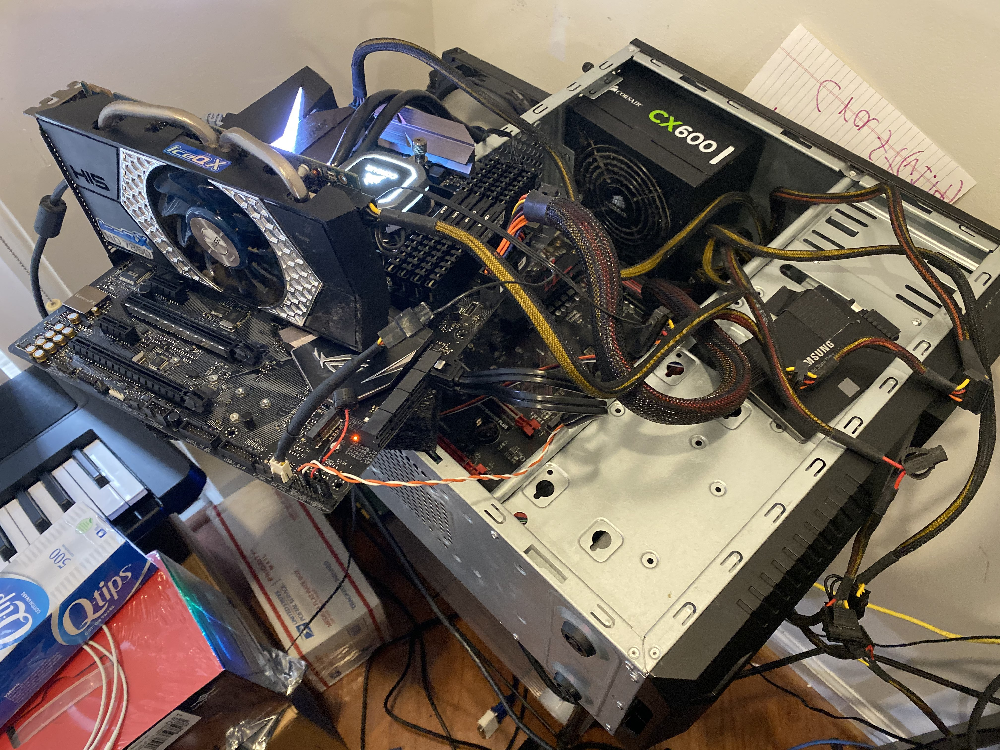
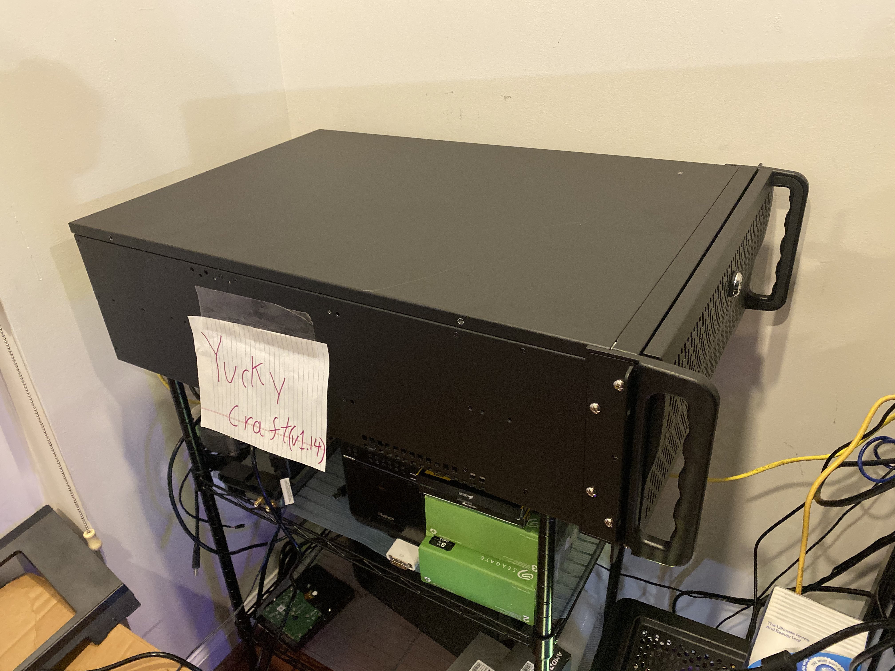

Hey all,

So about a week ago the motherboard on the server went kaput and since then had
been running "life support" mode. In other words, I frankensteined some old
unused hardware onto the server hardware to at least get things running again,
whee. See below (It's _a little_ messy):

Since I figured it was about time for an upgrade anyway, we've replaced both CPU
(R5 1600x -> R5 3600) and RAM (32gb -> 64gb) as well as installing everything
into a proper rackmount server chassis as we plan on overhauling the network
infrastructure/hardware later this year anyway. And obviously a new motherboard.

Keep an eye out for more hardware upgrades to come!

- Remi
