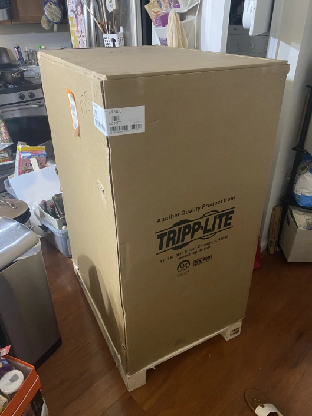
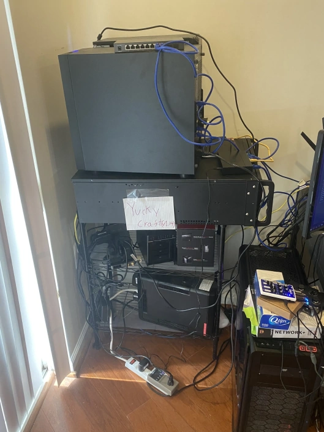
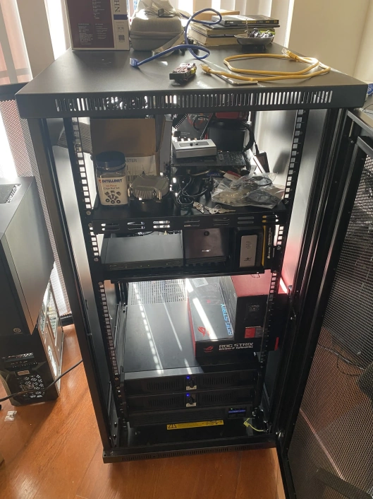
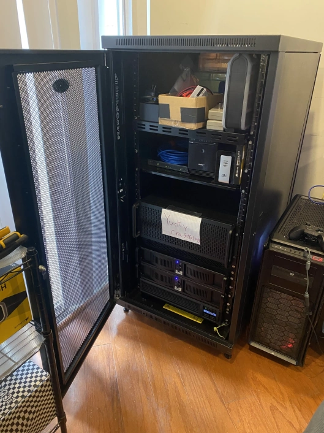
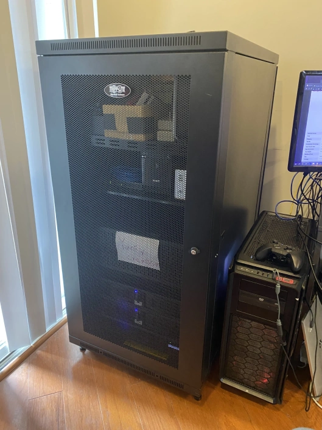

Hi hi.

Is this an important announcement? Not at all. Why am I making it then? Because new hardware is friggin' cool yo.

So maybe ~4 months ago I wrote a post about [Our Old Hardware Failing](https://yukkuricraft.net/announcements/Server-Upgrade-2021-02-27/). Since I had been thinking about making a homelab for a while at that point, I ended up moving our Yukkuricraft hardware into a 4U rack chassis but without a rack enclosure to put it in (See second pic in aforementioned post).

Fast forward to the present, and I ended up buying and receiving a 24U Tripp Lite 33" Depth Rack Enclosure last week!  

It was about time anyway given that the Jank Shelf TM was starting to get pretty cluttered and messy anyway.  

And obligatory jail cell pic.  

Anyway, with that out of the way, here's a pic of the enclosure half assembled.  

And finally after all is said and done, here's the final state of the rack.  
  

Though that said, "final" is a bit of a lie. I'm still planning on overhauling my entire home network setup with prosumer gear later this year as well.  That said, for now I'm gonna let me wallet recover for a while because boy did this rack enclosure cost a pretty penny.

Anyway, I'm done nerding out here. More posts to come.  
As always, have fun and take it easy~
- Remi
