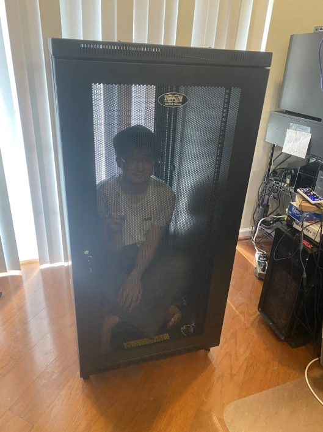

Hi hi.

Is this an important announcement? Not at all. Why am I making it then? Because new hardware is friggin' cool yo.

So maybe ~4 months ago I wrote a post about [Our Old Hardware Failing](https://yukkuricraft.net/announcements/Server-Upgrade-2021-02-27/). Since I had been thinking about making a homelab for a while at that point, I ended up moving our Yukkuricraft hardware into a 4U rack chassis but without a rack enclosure to put it in (See second pic in aforementioned post).

### Pics

Fast forward to the present, and I ended up buying a 24U Tripp Lite 33" Depth Rack Enclosure that came in last week!  

It was about time anyway given that the Jank Shelf TM was starting to get pretty cluttered and messy anyway.  

And obligatory jail cell pic.  

Anyway, with that out of the way, here's a pic of the enclosure half assembled.  

And finally after all is said and done, here's the final state of the rack.  
  

Though that said, "final" is a bit of a lie. I'm still planning on overhauling my entire home network setup with prosumer gear later this year as well. That said, for now I'm gonna let my wallet recover because boy did this rack enclosure and other parts cost a pretty penny.

### Some New Hardware

Here's a short list of some of components I had to buy for the rack:
- The 24U Enclosure
- Rack shelves
- `APC Smart-UPS X 1500VA 1200W 2U SMX1500RM2U`
- `APC AP7750 ATS Rack PDU, 1U`
- 2x `iStarUSA D-200 2U Rack Chassis` - Moved two secondary servers that were in desktop chassis into rack chassis.
- Super minor, but made custom length patch cables, too! Don't flip your T-568B wires!

### What's Next

So new hardware and all that is cool, but how do I know when something goes horribly wrong? The more moving parts in a setup, the more likely something is to break. That's why I now also have a Prometheus+Grafana instance on one of the secondary hosts. While this bit is still a work in progress, some things I'm planning on doing:
- Get metrics from `apcupsd` into Prometheus. There exists an [`apcupsd_exporter`](https://github.com/mdlayher/apcupsd_exporter) but it only seems to correctly export a subset of all available metrics, which I am currently using. However, if I can get the full set of data exposed by `apcupsd` into Prometheus that would be nice.
- Get some temperature and humdity sensors into the enclosure. These are pretty pricey, unfortunately.
- Related to our planned future network overhaul, right now we don't have the best granularity with network-related metrics. This is a limitation of using consumer level AIO network gear rather than using more powerful and customizable prosumer gear. For example, our router does not support SNMP natively and it seems there are limitations even with custom firmware (Thanks, ASUS).

And of course, getting the data into Prometheus is just half the battle. Need to actually build the dashboards for the metrics too. Here's an example of what my desktop graphs in Grafana look like right now.

### Conclusion

Anyway, I'm done nerding out here. Technology is cool. More posts to come.  
As always, have fun and take it easy~
- Remi
