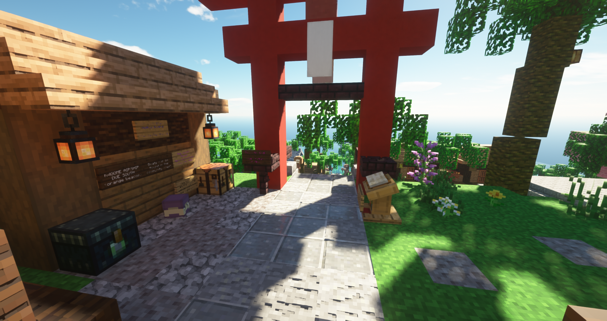
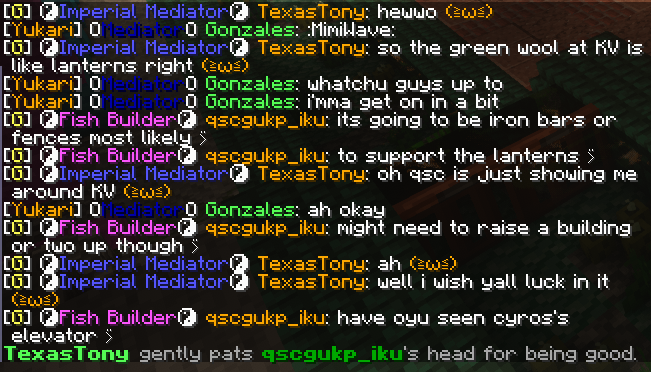

## A Tour of Survival

Our separate survival world provides a vanilla Minecraft experience, combined
with unique aspects such as features, public farms, community-driven towns, and
ships between these locations. From easy teleportation to large cities, we
promise you will have a survival experience like no other within our server and
community!

### Your First Day

It's your first day in survival. What is there to do? Maybe you want to build a
home somewhere, or perhaps you're just sightseeing. Either way, doing it will be
easy.

#### Kagome Summit

Start your journey on Kagome Summit, a bustling starting town filled with public
farms, villager shops, a community market, and fast travel to the most major
towns around our survival world. Of course, being on the coast of a large
continent, players can freely explore north by foot or cross the southern ocean
to new lands.

#### The Towns of Survival

Some players have done exceptional work in either rallying fellow players or
solo building massive builds in the form of towns. Curious about some of them,
want to visit? You can instantly reach some towns via boats or airships, located
respectively at Kagome's naval and airport docks. More information can be found
on the Towns page.

#### Hassle-free Land Claiming

Once you've found the perfect place for your new home, the next step is to build
it. In our survival, land claiming does not require any border plotting or
technical commands. Players are free to settle anywhere as long as it is not
within or too close to an obvious claimed land border.

#### Secure Your Chests

Our chest locks give players a safe and secure way of accessing their
containers. When you place a chest, it will be automatically locked to you.
Locks are also fully customizable, such as allowing access only to a
select group of people. Type `/lwc` for more info.

#### Set Your Homes

No need to stress about finding your way back home when going on an adventure!
Each rank comes with several personal warps called homes that you can easily set
with commands. These allow instantaneous teleportation, even between worlds,
whenever and wherever. The number of homes you can have is based on your rank
and is typically between 3 and 10.

#### Loot Recovery Made Easy

No one likes having to backtrack all the way to their death point should
misfortune befall them during an adventure. Here, all ranks have unlimited
access to the `/return` or `/back` command. This command allows teleportation to
one's previous death point or other places you have previously teleported from.

### Be Social

Being social through text alone is hard, but we try to make it easier. Using
things like commands to show your emotions, custom nicknames, and cross-platform
communication, connecting with the rest of the community is a walk in the park.

#### Meet Up With People Anytime and Anywhere

Made a friend here and want to visit their place on the other side of the map?
Teleportation commands allow players to teleport to one another instantly
anytime. To teleport to someone, simply type `/tpa <username>`. If you want to
bring someone to you, you can type `/tpahere <username>` instead.

#### Express Yourself

Of course, simply typing in chat isn't always enough to express yourself.
A good way to help express yourself to others is through emotes. Our large pool
of commands provide a suite of expressions to help spice up your chatter. From
pats to hugs and more, we probably have it. Note that, for the comfort of
everyone, we lock some actions like kissing or jumpscares behind higher ranks.

Wish to be referred by something other than your username? Want it shortened?
At Noble rank, you can request a nickname. Just notify one of our friendly staff
members and, should it pass the approval phase, you can go around in style with
your new nickname!  
***Note: Touhou nicknames are subject to heavy scrutiny and will only be given to
popular players who are closely associated with a character.***

Need to do something? Dropped off? Set yourself to AFK to notify other players
that you are not present. This command will also let the server know to ignore
you when other players try to skip the night in survival.

#### Simple Cross-Platform Communication

Jumping between Discord and Minecraft all the time can indeed be a hassle. Maybe
you don't want to play Minecraft but just want to talk with the people on the
server. Both are made easier by our two-way Discord-Minecraft chat. Furthermore,
discord users can even check who is online by typing in `playerlist`!

#### Event Items

Occasionally we may hold special events. One of the rewards we may give to all
participants of these events are unique items only obtainable through commands.

#### Remicare

Found a seemingly abandoned build you want to claim? Contact a staff member
about Remicare. Do note this policy of claiming unwanted builds comes with
requirements, mainly the original owner's rank, a three-month period of staff
recognized inactivity and a reasonable reason for the Remicare.

### More Features for Survival

Vanilla is fun, but sometimes, you just wish you had a bit more. No need to
worry; we use several plugins to implement a vanilla+ like experience.

#### Sign-Based Doors, Gates, Bridges, Elevators, and More

No time for fancy redstone based contraptions? In survival, you can use signs as
doors, gates, bridges, and even elevators! You can also use signs to toggle
between torches and redstone torches.

#### Better Redstone

If you do want to work with redstone, don't be alarmed. We have several
quality-of-life features to make your life easier as well! One example is
using coals to measure redstone power. Want to make easy hidden switches? We
have those! There is also the option of better control over lighting. Turn
glass to glowstone and pumpkins to jack-o-lanterns with some redstone just
as easily as you power a normal lamp. You can even turn the fire on a
netherrack block on and off.

#### A More Immersive Experience with Furniture

Need a rest or want to read some books? Right-click a stair block with your bare
hand or type `/sit` to sit down and relax, or pick up a random book passage from
a bookshelf! If just take a nap and shake off any phantom woes, you can `/nap`
to lay down wherever you feel like.

#### Fewer Chores, More Fun

Some things in Vanilla just feels like a drag. For example, finding just the
right painting more your room. On Yukkuricraft, you can just right-click on the
painting instead to scroll through different paintings. Our Sages also have the
ability to easily edit armor stands to their liking. No more struggling to
equip or unequip items or find the right rotation or pose.

#### Mass Deforestation Imminent

Trying to gather wood but sick of climbing up trees to get those last few pesky
blocks? Or you just dislike people who leave half floating trees? Either way,
players can use a gold axe to cut down all logs in contact with each other
instantly.
